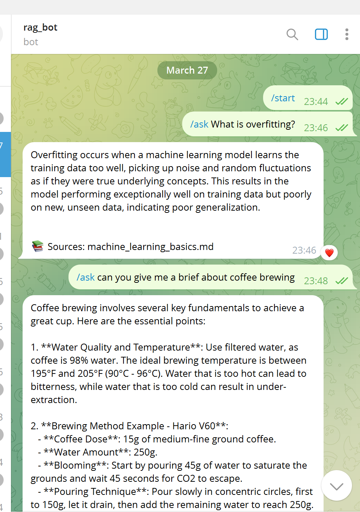
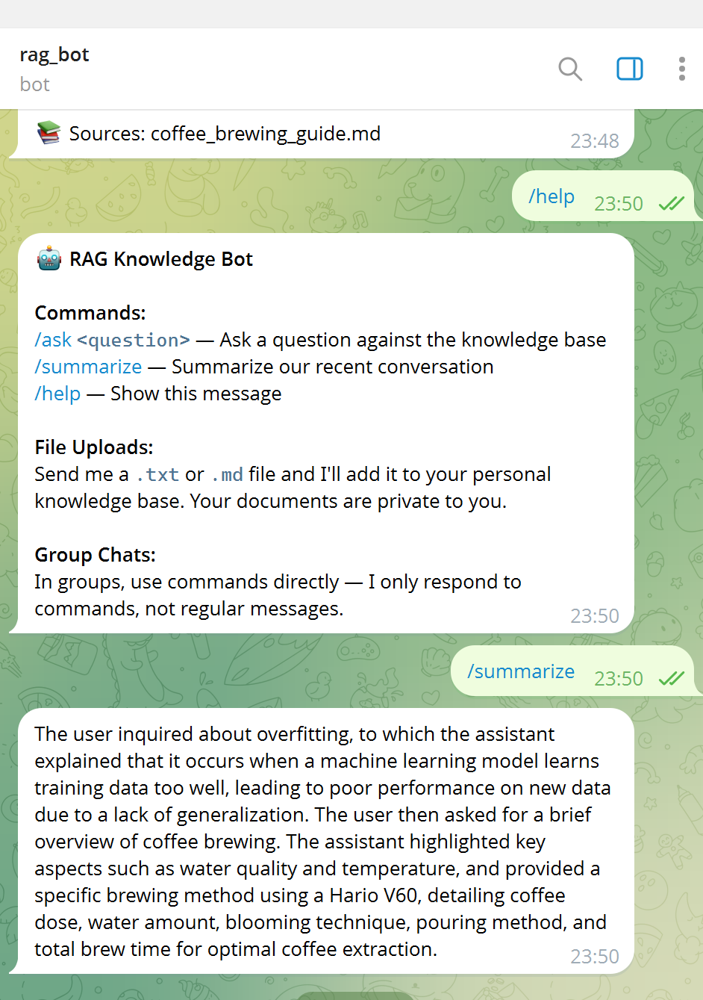
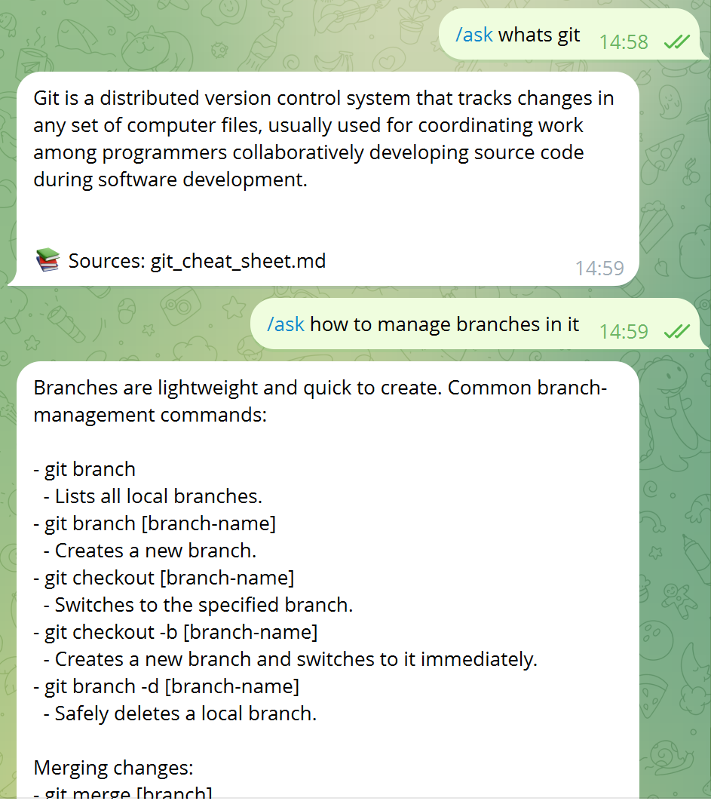

# RAG Telegram Bot

A Telegram bot that answers questions using Retrieval-Augmented Generation (RAG). You upload documents, ask questions, and the bot finds relevant parts from your documents and uses an LLM to give you a grounded answer with source citations.

Bot name: **@RAGHaterBot**

## What It Does

| Feature | How it works |
|---|---|
| `/ask <question>` | Finds relevant chunks from your documents and answers using an LLM |
| `/summarize` | Summarizes your recent conversation (last 3 Q&A turns) |
| `/help` | Shows available commands |
| File upload | Send a `.txt` or `.md` file to add it to your personal knowledge base |
| Source citations | Every answer shows which documents were used |
| Conversation memory | Bot remembers your last 3 interactions for context |
| Query caching | Same question asked twice skips re-embedding |
| Group chat support | Works in groups — responds only to commands |
| Multi-user isolation | Your uploaded files are private to you; default docs are shared |
| Intent classification | Uses a lightweight LLM (GPT-4o-mini) to understand what you mean before searching |
| Smart file references | Say "summarize the file" after uploading and it knows which file you mean |

## Demo

### Asking questions with source citations



### /help and /summarize



### Follow-up questions with context



## How It Works

```
User sends /ask "What is overfitting?"
    |
    v
Intent Classifier (GPT-4o-mini)
    --> Decides: is this a greeting? a question? about a specific file?
    --> Returns: intent type + target file + cleaned search query
    |
    v
Retrieval (based on intent)
    - greeting     --> skip everything, respond directly
    - rag_query    --> embed query --> search all docs in Qdrant --> top 3 by cosine similarity
    - file_query   --> embed query --> search only the target file in Qdrant
    - file_summary --> fetch all chunks of that file in order (no embedding needed)
    |
    v
Generation (GPT-5-mini)
    --> Gets: retrieved chunks as context + your question + recent conversation history
    --> Returns: grounded answer
    |
    v
Response sent to Telegram with source citations
```

### Why Intent Classification?

The bot needs to decide **how** to search before it can search. For example:

- "summarize the file" --> don't do similarity search, fetch all chunks of the last uploaded file
- "what is overfitting?" --> normal search across all documents
- "hey" --> don't search at all, just greet back

We initially used static keyword lists for this, but they broke on anything outside the list (e.g. "give me the gist" or "namaste"). Replacing them with a cheap GPT-4o-mini call (~$0.15/1M tokens, ~200ms) handles any phrasing naturally.

## Tech Stack

| Component | Technology | Why |
|---|---|---|
| Bot framework | python-telegram-bot 22.7 | Fully async, well-documented |
| Embeddings | sentence-transformers (all-MiniLM-L6-v2, 384-dim) | Lightweight (80MB), runs on CPU, good quality for short text |
| Vector database | Qdrant (local, file-based) | No Docker needed, data persists in `qdrant_data/` folder |
| LLM (generation) | OpenAI GPT-5-mini | Primary model for answering questions and summarization |
| LLM (intent) | OpenAI GPT-4o-mini | Cheap and fast, used only to classify user intent before retrieval |
| Text splitting | LangChain RecursiveCharacterTextSplitter | Splits on natural boundaries (headings, paragraphs, sentences) instead of fixed character counts |
| Language | Python 3.13 | |

## Project Structure

```
rag_telegram_bot/
├── main.py                        # Entry point — wires all services together and starts the bot
├── core/
│   ├── config.py                  # All settings loaded from .env
│   ├── rag_engine.py              # Main pipeline: classify intent --> retrieve --> generate
│   ├── memory.py                  # Per-user conversation history + last upload tracking
│   └── cache.py                   # Query embedding cache (avoids re-embedding same questions)
├── bot/
│   └── handlers.py                # Telegram command handlers (/ask, /help, /summarize, uploads)
├── services/
│   ├── intent.py                  # GPT-4o-mini intent classifier with structured JSON output
│   ├── qdrant_service.py          # Async Qdrant wrapper (search, upsert, fetch by source)
│   ├── embedding.py               # SentenceTransformer with async bridge (run_in_executor)
│   ├── llm_gateway.py             # Async OpenAI wrapper for generation and summarization
│   └── ingestion.py               # Reads files --> chunks them --> embeds --> stores in Qdrant
├── utils/
│   └── chunker.py                 # LangChain RecursiveCharacterTextSplitter wrapper
├── data/
│   └── default_docs/              # 7 pre-loaded knowledge base documents
├── tests/                         # Unit tests
├── .env.example                   # Template — copy to .env and add your keys
├── .gitignore
└── requirements.txt
```

## Knowledge Base (Pre-loaded Documents)

The bot comes with 7 default documents that are available to all users:

| Document | Topics covered |
|---|---|
| machine_learning_basics.md | Supervised/unsupervised learning, overfitting, cross-validation |
| python_faq.md | Decorators, GIL, lists vs tuples, virtual environments |
| pasta_recipes.md | Carbonara, aglio e olio, pesto Genovese (full recipes) |
| coffee_brewing_guide.md | Pour-over (V60), French press, espresso |
| git_cheat_sheet.md | Git commands, branching, merging, rebasing |
| company_remote_policy.md | Remote work rules, equipment, core hours |
| onboarding_guide.md | New employee first week, tools, HR contacts |

Users can also upload their own `.txt` or `.md` files. Uploaded files are private to each user.

## Setup and Running

### What You Need

- Python 3.10 or higher
- A Telegram bot token (get one from [@BotFather](https://t.me/BotFather))
- An OpenAI API key (from [platform.openai.com](https://platform.openai.com))

### Step 1: Install dependencies

```bash
cd rag_telegram_bot
pip install -r requirements.txt
```

### Step 2: Set up your API keys

Copy the example env file and fill in your keys:

```bash
# Windows
copy .env.example .env

# Mac/Linux
cp .env.example .env
```

Then edit `.env`:

```
TELEGRAM_BOT_TOKEN=your-bot-token-here
OPENAI_API_KEY=your-openai-api-key-here
```

### Step 3: Run the bot

```bash
python main.py
```

On first run, the bot will:
1. Download the embedding model (~80MB, one time only)
2. Create the Qdrant collection and index all 7 default documents
3. Start listening for Telegram messages

Future runs skip the indexing step (data is saved in `qdrant_data/`).

### Step 4: Run tests

```bash
python -m unittest discover -s tests
```

## Design Decisions

**Async everywhere** — python-telegram-bot v22 is fully async. The CPU-bound embedding model runs in a thread pool (`run_in_executor`) so it doesn't block the event loop.

**Chunking** — 1500-character chunks with 100-character overlap, split using LangChain's `RecursiveCharacterTextSplitter`. It splits on `## ` headings first, then `### `, then paragraphs, then sentences. This keeps full recipe sections or FAQ answers in one chunk instead of cutting mid-sentence.

**Score threshold (0.4)** — Cosine similarity results below 0.4 are filtered out for normal queries. This prevents random low-relevance chunks from appearing as answers (e.g. asking "hey" shouldn't return pasta recipes).

**Two-model architecture** — GPT-4o-mini handles intent classification (cheap, fast, structured output). GPT-5-mini handles answer generation (stronger reasoning). This keeps costs low while maintaining quality.

**Cache normalization** — Queries are lowercased, stripped, and whitespace-collapsed before cache lookup. "What is overfitting?" and "what is overfitting" hit the same cache entry.

**Multi-tenant via payload filtering** — All users share one Qdrant collection. Each chunk has a `user_id` field. Searches filter by `user_id = "global" OR user_id = <current_user>`. No per-user collection sprawl.

## Notes for Reviewers

This bot requires **your own API keys** to run. The `.env` file is not included in the repository (it's in `.gitignore`).

To test it:
1. Create a Telegram bot via [@BotFather](https://t.me/BotFather) to get a bot token
2. Get an OpenAI API key from [platform.openai.com](https://platform.openai.com)
3. Follow the setup steps above

The bot works out of the box with the 7 pre-loaded documents. You can also upload your own `.txt` or `.md` files to test the personal knowledge base feature.
